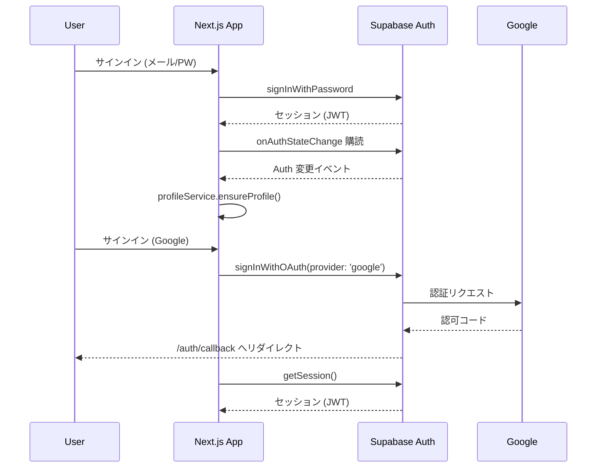

# 認証フロー概要（Supabase Auth）

このドキュメントでは、本プロジェクトで採用している Supabase Auth の構成をまとめます。第三者が参照しても流れが追えるよう、設定・コード・関連資料を簡潔に整理しています。

## 採用している認証方式
- **メールアドレス + パスワード**: `supabase.auth.signInWithPassword` / `signUp` を利用。
- **Google OAuth**: `supabase.auth.signInWithOAuth({ provider: 'google' })` を利用。
- **モック認証（開発/テスト用）**: `NEXT_PUBLIC_SKIP_AUTH=true` 等で `shouldUseMockAuth()` が `true` になると、ローカルセッションとテスト用プロフィールを自動作成。

## 主要なコード構成
| 役割 | ファイル | 補足 |
|------|---------|------|
| Supabase クライアント生成 | `src/lib/supabase.ts` | `createBrowserClient` で 1 インスタンスを共有。Auth は `autoRefreshToken`/`persistSession` を有効化。 |
| 認証サービス | `src/services/authService.ts` | メールサインイン/サインアップ、Google OAuth、`getSession`、`onAuthStateChange` をラップ。ログ出力あり。 |
| 認証状態管理 | `src/hooks/useAuthState.ts` | 初回セッション取得・`onAuthStateChange` 購読。認証済みユーザーには `profileService.ensureProfile` を実行。モック認証の分岐あり。 |
| 認証操作（UI 呼び出し層） | `src/hooks/useAuthActions.ts` | フォームから呼び出される `signIn` / `signUp` / `signInWithGoogle` など。ロード状態とエラーを管理。 |
| コンテキスト | `src/contexts/AuthContext.tsx` | 上記ふたつのフックを束ね、`useAuth()` から利用可能に。 |
| サインイン画面 | `src/app/auth/signin/page.tsx` | フォーム送信 + Google ボタン。`signInWithGoogle` クリック時は `redirectTo=/auth/callback?redirect=...` を指定。 |
| サインアップ画面 | `src/app/auth/signup/page.tsx` | サインアップ後に `signInWithGoogle` へ誘導する導線を用意。 |
| OAuth コールバック | `src/app/auth/callback/page.tsx` | Supabase からのリダイレクトを受け取り、`redirect` クエリがあれば指定画面へ転送。 |

## 環境変数
| 変数 | 用途 |
|------|------|
| `NEXT_PUBLIC_SUPABASE_URL` / `NEXT_PUBLIC_SUPABASE_PUBLISHABLE_KEY` | Supabase クライアントの初期化。 |
| `SUPABASE_SECRET_KEY` | Worker / Server 側で RPC を呼び出す用途（Cloudflare Worker にシークレット登録）。 |
| `NEXT_PUBLIC_SKIP_AUTH` | モック認証を有効化するフラグ。 |
| `SUPABASE_AUTH_URL` 等 | Supabase 側で自動設定されるためコード内では直接参照していません。 |

## Google OAuth 設定の要点
1. Supabase Studio → **Authentication → Providers → Google** で Client ID / Secret を登録。<br>   - `https://<project>.supabase.co/auth/v1/callback` が自動生成される。
2. Supabase Studio → **Authentication → URL Configuration**<br>   - `Redirect URLs` に `https://your-app-domain/auth/callback`（本番・ステージング両方）を登録。
3. Google Cloud Console → **OAuth 2.0 クライアント ID**<br>   - `承認済みのリダイレクト URI` に Supabase 側の URL を追加。<br>   - 同意画面を「本番」公開し、必要なスコープ（`email`, `profile`）を設定。

詳細手順は既存ドキュメントも参照してください：
- [docs/google-oauth-setup.md](../google-oauth-setup.md)
- [docs/google-oauth-checklist.md](../google-oauth-checklist.md)
- [docs/devlog/pkce-error-resolution.md](../devlog/pkce-error-resolution.md)

## 認証フロー図（概要）


## RLS と連携
- RLS では `auth.uid()` / `auth.role()` を利用。例：`profiles` テーブルの UPDATE ポリシーで `id = auth.uid()` を条件に設定。<br>
- Supabase Auth が発行した JWT がリクエストヘッダーに自動付与されるため、DB 側はユーザー ID を判別可能。<br>
- テーブルごとのポリシーは Supabase Studio で確認でき、Performance Advisor の Warning を参考に整理します。

## トラブルシューティング・メモ
- `Cloudflare` デプロイ時に `NEXT_PUBLIC_SKIP_AUTH` が `true` のままだとモック認証が動作するので、本番環境では必ず外す。<br>
- Google OAuth で PKCE エラーが出る場合は、Supabase 側の `Redirect URL` と Google Cloud Console の設定が一致しているか確認。<br>
- Supabase Auth のログは **Authentication → Logs** でエラー検索可能。

## 参考 URL
- Supabase Auth ガイド: <https://supabase.com/docs/guides/auth>
- Supabase Auth OAuth: <https://supabase.com/docs/guides/auth/social-login>
- Supabase Auth API (JS): <https://supabase.com/docs/reference/javascript/auth-sign-in-with-oauth>
- PostgreSQL Row Level Security: <https://postgresql.org/docs/current/ddl-rowsecurity.html>
```
