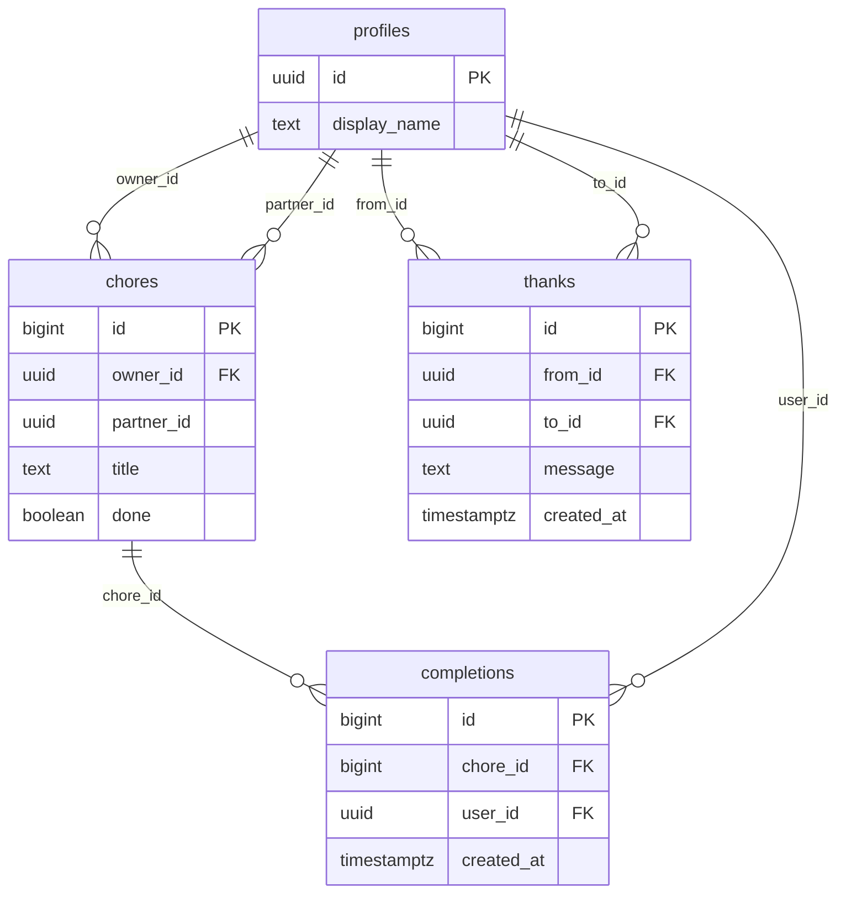

# ERD

> Mermaid対応エディタなら図で表示されます。PNG運用にする場合は `docs/erd.png` を貼ってOK。

```mermaid
erDiagram
  profiles {
    uuid id PK
    text display_name
  }

  chores {
    bigint id PK
    uuid owner_id FK
    uuid partner_id
    text title
    boolean done
  }

  completions {
    bigint id PK
    bigint chore_id FK
    uuid user_id FK
    timestamptz created_at
  }

  thanks {
    bigint id PK
    uuid from_id FK
    uuid to_id FK
    text message
    timestamptz created_at
  }

  profiles ||--o{ chores : "owner_id"
  profiles ||--o{ chores : "partner_id"
  chores ||--o{ completions : "chore_id"
  profiles ||--o{ completions : "user_id"
  profiles ||--o{ thanks : "from_id"
  profiles ||--o{ thanks : "to_id"
```