# パートナー招待機能 設計ドキュメント

## 概要

夫婦/カップル向け家事管理アプリにおけるパートナー招待機能の設計。
一方のユーザーが登録後、パートナーを招待してアカウント連携を行う機能。

## 🎯 機能要件

### 基本フロー
1. **Aさん（招待者）**: アプリに登録・ログイン
2. **Aさん**: パートナー招待リンクを生成
3. **Aさん**: 招待リンクをBさんに共有（URL/QRコード）
4. **Bさん（被招待者）**: 招待リンクからアプリにアクセス
5. **Bさん**: アカウント作成・ログイン
6. **システム**: AさんとBさんのアカウントを自動連携
7. **完了**: 両者が同じ家事リストを共有

### 機能詳細
- 招待リンクの生成・管理
- QRコード生成（オプション）
- 招待状態の管理
- パートナー連携の自動化
- 既存家事データの共有

## 📊 データベース設計

### 新規テーブル: `partner_invitations`

```sql
CREATE TABLE partner_invitations (
  id BIGSERIAL PRIMARY KEY,
  inviter_id UUID NOT NULL REFERENCES profiles(id) ON DELETE CASCADE,
  invite_code TEXT UNIQUE NOT NULL,
  invitee_email TEXT, -- オプション: 招待先メールアドレス
  status TEXT NOT NULL DEFAULT 'pending' CHECK (status IN ('pending', 'accepted', 'expired', 'cancelled')),
  expires_at TIMESTAMPTZ NOT NULL DEFAULT (NOW() + INTERVAL '7 days'),
  created_at TIMESTAMPTZ NOT NULL DEFAULT NOW(),
  accepted_at TIMESTAMPTZ,
  accepted_by UUID REFERENCES profiles(id) ON DELETE SET NULL
);

-- インデックス
CREATE INDEX idx_partner_invitations_invite_code ON partner_invitations(invite_code);
CREATE INDEX idx_partner_invitations_inviter_id ON partner_invitations(inviter_id);
CREATE INDEX idx_partner_invitations_status ON partner_invitations(status);
```

### 既存テーブルの拡張: `profiles`

```sql
-- パートナー関係を管理するカラムを追加
ALTER TABLE profiles ADD COLUMN partner_id UUID REFERENCES profiles(id) ON DELETE SET NULL;
ALTER TABLE profiles ADD COLUMN partnership_created_at TIMESTAMPTZ;

-- インデックス
CREATE INDEX idx_profiles_partner_id ON profiles(partner_id);
```

### 更新されたERD

```mermaid
erDiagram
  profiles {
    uuid id PK
    text display_name
    uuid partner_id FK
    timestamptz partnership_created_at
  }

  partner_invitations {
    bigint id PK
    uuid inviter_id FK
    text invite_code UK
    text invitee_email
    text status
    timestamptz expires_at
    timestamptz created_at
    timestamptz accepted_at
    uuid accepted_by FK
  }

  chores {
    bigint id PK
    uuid owner_id FK
    uuid partner_id FK
    text title
    boolean done
    timestamptz created_at
  }

  completions {
    bigint id PK
    bigint chore_id FK
    uuid user_id FK
    timestamptz created_at
  }

  thanks {
    bigint id PK
    uuid from_id FK
    uuid to_id FK
    text message
    timestamptz created_at
  }

  profiles ||--o| profiles : "partner_id"
  profiles ||--o{ partner_invitations : "inviter_id"
  profiles ||--o{ partner_invitations : "accepted_by"
  profiles ||--o{ chores : "owner_id"
  profiles ||--o{ chores : "partner_id"
  chores ||--o{ completions : "chore_id"
  profiles ||--o{ completions : "user_id"
  profiles ||--o{ thanks : "from_id"
  profiles ||--o{ thanks : "to_id"
```



## 🔐 RLS (Row Level Security) ポリシー

### `partner_invitations` テーブル

```sql
-- RLS有効化
ALTER TABLE partner_invitations ENABLE ROW LEVEL SECURITY;

-- 招待者は自分の招待のみ閲覧・操作可能
CREATE POLICY "Users can view their own invitations" ON partner_invitations
  FOR SELECT USING (inviter_id = auth.uid());

CREATE POLICY "Users can create invitations" ON partner_invitations
  FOR INSERT WITH CHECK (inviter_id = auth.uid());

CREATE POLICY "Users can update their own invitations" ON partner_invitations
  FOR UPDATE USING (inviter_id = auth.uid());

-- 招待コードによる公開アクセス（招待受諾用）
CREATE POLICY "Public can view valid invitations by code" ON partner_invitations
  FOR SELECT USING (
    status = 'pending' AND 
    expires_at > NOW()
  );
```

### `profiles` テーブルの更新

```sql
-- パートナー情報の閲覧権限
CREATE POLICY "Users can view partner profile" ON profiles
  FOR SELECT USING (
    id = auth.uid() OR 
    partner_id = auth.uid() OR 
    id = (SELECT partner_id FROM profiles WHERE id = auth.uid())
  );
```

## 🔧 API設計

### 招待関連エンドポイント

#### 1. 招待リンク生成
```typescript
// POST /api/invitations
type CreateInvitationRequest = {
  invitee_email?: string; // オプション
};

type CreateInvitationResponse = {
  invite_code: string;
  invite_url: string;
  expires_at: string;
};
```

#### 2. 招待情報取得
```typescript
// GET /api/invitations/:invite_code
type GetInvitationResponse = {
  inviter_name: string;
  inviter_email: string;
  status: 'pending' | 'expired';
  expires_at: string;
};
```

#### 3. 招待受諾
```typescript
// POST /api/invitations/:invite_code/accept
type AcceptInvitationResponse = {
  success: boolean;
  partner_id: string;
  shared_chores_count: number;
};
```

#### 4. 招待一覧取得
```typescript
// GET /api/invitations
type GetInvitationsResponse = {
  invitations: {
    id: string;
    invite_code: string;
    invitee_email?: string;
    status: string;
    created_at: string;
    expires_at: string;
  }[];
};
```

## 🎨 UI/UX設計

### 1. 招待リンク生成画面
```
┌─────────────────────────────────────┐
│ 🤝 パートナーを招待                    │
├─────────────────────────────────────┤
│ パートナーのメールアドレス（任意）        │
│ [                    ] 📧           │
│                                     │
│ [ 招待リンクを生成 ]                  │
│                                     │
│ 生成された招待リンク:                  │
│ https://app.com/invite/abc123       │
│ [ コピー ] [ QRコード ]               │
│                                     │
│ ⏰ 有効期限: 2025-01-14 まで          │
└─────────────────────────────────────┘
```

### 2. 招待受諾画面
```
┌─────────────────────────────────────┐
│ 🎉 招待を受け取りました                │
├─────────────────────────────────────┤
│ 田中太郎さんから家事管理アプリへの      │
│ 招待が届いています。                   │
│                                     │
│ 👫 一緒に家事を管理しませんか？         │
│                                     │
│ [ アカウントを作成して参加 ]           │
│ [ 既存アカウントでログイン ]           │
│                                     │
│ ⏰ 招待の有効期限: 3日後               │
└─────────────────────────────────────┘
```

### 3. パートナー連携完了画面
```
┌─────────────────────────────────────┐
│ ✅ パートナー連携が完了しました！        │
├─────────────────────────────────────┤
│ 🎊 田中太郎さんとの連携が完了しました    │
│                                     │
│ 📋 共有された家事: 5件                │
│ 🏠 これから一緒に家事を管理しましょう！  │
│                                     │
│ [ 家事一覧を見る ]                    │
└─────────────────────────────────────┘
```

## 🔄 実装フロー

### Phase 1: データベース準備
1. `partner_invitations` テーブル作成
2. `profiles` テーブルにパートナー関連カラム追加
3. RLSポリシー設定
4. ERDドキュメント更新

### Phase 2: バックエンド実装
1. 招待コード生成ロジック
2. 招待関連API実装
3. パートナー連携ロジック
4. 既存家事データの共有処理

### Phase 3: フロントエンド実装
1. 招待リンク生成UI
2. 招待受諾UI
3. QRコード生成（オプション）
4. パートナー状態表示

### Phase 4: テスト・改善
1. E2Eテスト実装
2. エラーハンドリング強化
3. UX改善

## 🔒 セキュリティ考慮事項

### 招待コード
- 推測困難な文字列（UUID v4 または crypto.randomBytes）
- 有効期限設定（デフォルト7日）
- 一度使用したら無効化

### アクセス制御
- RLSによる厳密な権限管理
- 招待コードの漏洩対策
- レート制限（招待生成の頻度制限）

### データ保護
- 個人情報の最小化
- 期限切れ招待の自動削除
- ログ記録とモニタリング

## 📋 実装チェックリスト

### データベース
- [ ] `partner_invitations` テーブル作成
- [ ] `profiles` テーブル拡張
- [ ] RLSポリシー設定
- [ ] インデックス作成
- [ ] マイグレーションスクリプト作成

### API
- [ ] 招待生成API
- [ ] 招待情報取得API
- [ ] 招待受諾API
- [ ] 招待一覧API
- [ ] エラーハンドリング

### フロントエンド
- [ ] 招待生成UI
- [ ] 招待受諾UI
- [ ] QRコード生成
- [ ] パートナー状態表示
- [ ] レスポンシブ対応

### テスト
- [ ] ユニットテスト
- [ ] 統合テスト
- [ ] E2Eテスト
- [ ] セキュリティテスト

## 🧭 運用ガイド

本機能は「対等な1対1のパートナー関係」を前提に設計されています。招待者・被招待者に権限差はなく、受諾後は相互リンクで同一の機能にアクセスできます。以下、日常運用の指針を示します。

### 運用方針（基本）
- パートナー関係は上下ではなく「対等なペア」。役割差は設けない。
- 招待コードは単回利用・期限付き。使用後は必ず失効させる。
- 受諾時は両者の `profiles.partner_id` を相互に設定し、整合性を必ず担保する。
- 解除時は双方向に `partner_id = NULL` を設定し、片側残りを防ぐ。

### 関係モデルの確認
- `profiles.partner_id` により1対1リンクを管理。
- 健全性チェックは `PartnerService.checkPartnershipStatus` を使用し、相互リンク（A→B、B→A）かを確認。
- 既にリンク済みのユーザーは新規受諾不可とする（UI/サーバーの検証を徹底）。

### 招待リンクの運用
- 生成元: 招待者がリンクを生成し、URL/QRで共有。
- 形式: `https://<host>/invite/<code>`。`code` は推測困難なランダム文字列（RPC: `generate_invite_code`）。
- 失効: 期限切れ、受諾、キャンセル時に `status` を更新。定期的に `cleanup_expired_invitations` を実行。
- 承認フロー: 被招待者がリンクを開き、認証後に受諾。受諾成功で双方向リンクが確立（RPC: `link_partners` or サービス層）。
- 参考: 「リンクのみ承認」モデルの概要は `docs/reference/invite-link-approval.md` を参照。

### 権限/RLSの運用
- 共有対象（例: `chores`, `thanks`）は「本人」または「本人のパートナー」にアクセス許可。
- RLSはテーブルごとに「所有者」または「所有者のパートナー」を許可するポリシーを維持し、差分が出ないよう定期点検。
- 新規テーブル追加時は同方針でRLSを定義し、E2Eで権限パスを検証。

### 解除・再連携
- 解除: `PartnerService.unlinkPartner` を利用して双方の `partner_id` を `NULL` に更新。
- 再連携: 新規招待を生成して受諾。既存リンクが残っていないことを健全性チェックで確認。
- 注意: 解除後のデータ表示（共有家事の可視性、通知）に不整合がないかUIとRLSの両面で確認。

### 管理・サポートオペレーション
- 招待のステータス監査: `pending` の陳腐化、期限切れの自動クリーンアップ状況を監視。
- リンク整合性監査: 片側のみリンクされていないレコードを検知するジョブ（週次）を推奨。
- 手動回復手順: 片側リンク残りが発生した場合は、`unlinkPartner` → 再招待 → 受諾で復旧。
- レート制限: 招待生成の過剰発行対策（IP/ユーザー単位）。

### 監視とメトリクス
- 招待生成数（成功/失敗）、受諾率、期限切れ率。
- 受諾からリンク確立までのレイテンシ。
- 相互リンク不整合検出件数（ゼロであることが望ましい）。
- 解除件数、解除後の再連携率。

### 異常時対応
- 招待リンクの誤共有・漏洩: 招待をキャンセル後、再生成を案内。期限短縮と通知を検討。
- 二重受諾試行: 単回利用の検証で弾く。UIに明示エラーと再招待導線を提示。
- 既リンクユーザーが受諾: 受諾不可エラーを返し、解除→再招待の手順を案内。

### よくある質問（FAQ）
- 招待者と被招待者に権限差はありますか？→ いいえ、対等です。
- 招待リンクは何度も使えますか？→ いいえ、単回利用です。
- 期限が切れた場合は？→ 再生成してください。古いリンクは失効しています。
- 解除するとデータは消えますか？→ データは残りますが、共有表示や操作権は解除されます。

### テストと検証（運用時）
- 招待生成→共有→受諾→相互リンク成立（正常系E2E）。
- 期限切れ招待の受諭不可、単回利用の再受諾不可（異常系）。
- 既リンクユーザーの受諾不可、解除→再連携の回復手順。
- RLSのアクセス境界（本人/パートナー）での表示・更新が一貫していること。

### 文言/UXガイドライン
- 文言は「対等なパートナー」を前提に、上下関係を連想させない表現に統一。
- 受諾不可時は理由と次アクション（解除・再招待）を明確に提示。
- 招待画面に有効期限と単回利用である注意書きを表示。

### 変更管理
- 招待有効期限、単回利用ポリシー、RLSの方針変更時はドキュメント更新とE2E再実行を必須化。
- RPC（`generate_invite_code`, `link_partners`, `cleanup_expired_invitations`）の仕様変更はAPI層・フロントの整合性確認をセットで実施。

---

**作成日**: 2025-09-07  
**最終更新**: 2025-10-17  
**ステータス**: 設計完了・実装待ち